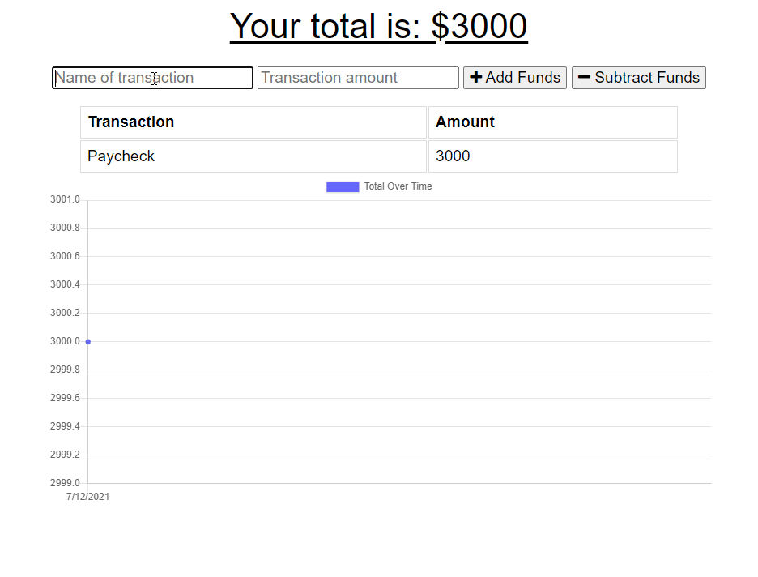

# Budget Tracker with Progressive Web App Features



## Overview
Given a functional budget track app that works online, the user is tasked with giving it an additional features to ensure offline use in the form of a PWA. IndexedDB, a web manifest, and a service worker script play important roles in making this possible.

## Table of Contents  
1. [Pseudocode](#pseudocode)  
2. [Installation](#installation) 
3. [Usage](#usage) 
4. [Links](#links)

## Pseudocode
1. Create an IndexedDB script for offline storage.
2. Create a manifest to ensure appropriate items are downloaded for offline mode.
3. Create a service worker script to cache appropriate items for offline mode

## Installation
-  ```npm i```

## Usage
- ```npm run start``` to start the server.
- While using Google Chrome, click on the icon at the end of the address bar to install, the app as a PWA.

## Resources
- [PWA](https://web.dev/progressive-web-apps/)
- [Service Worker API](https://developer.mozilla.org/en-US/docs/Web/API/Service_Worker_API)
- [IndexedDB API](https://developer.mozilla.org/en-US/docs/Web/API/IndexedDB_API)
- [Manifest](https://developer.mozilla.org/en-US/docs/Web/Manifest)

## Links
- [Repository](https://github.com/huirayj/budget-tracker)
- [Deployed Site](https://budget-tracker-huirayj.herokuapp.com/)
